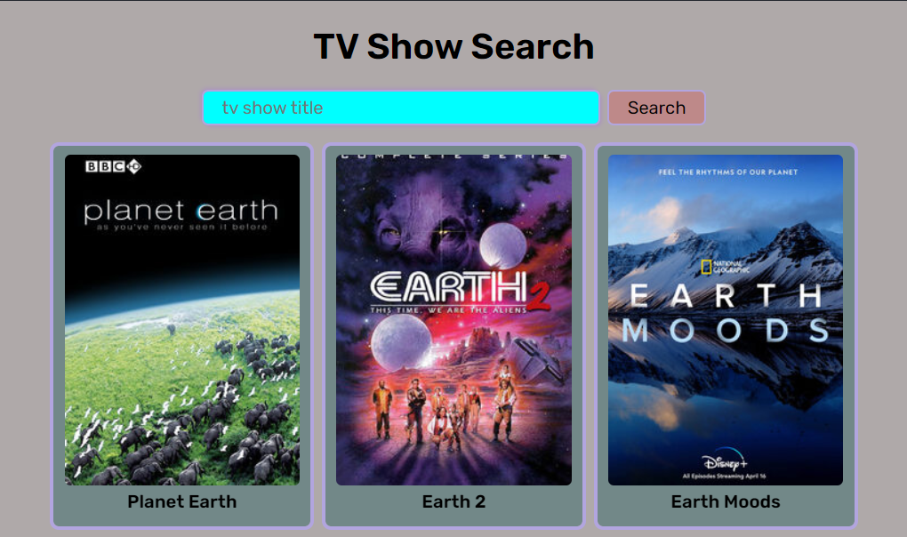

# TV Show Search App

<!-- add image to file-->

- This app will search for TV shows based on the shows name.
- Asynchronously gathers data using Axios to make API calls to the TVMaze API.
- Responsive design using media queries and flex-box.
- Custom loading animation using keyframe's, with the addition of a simulated delay using a custom timeout function.

## Next Steps
- dynamically load results in the search bar.
- the user can click on the show to see more information about it.
